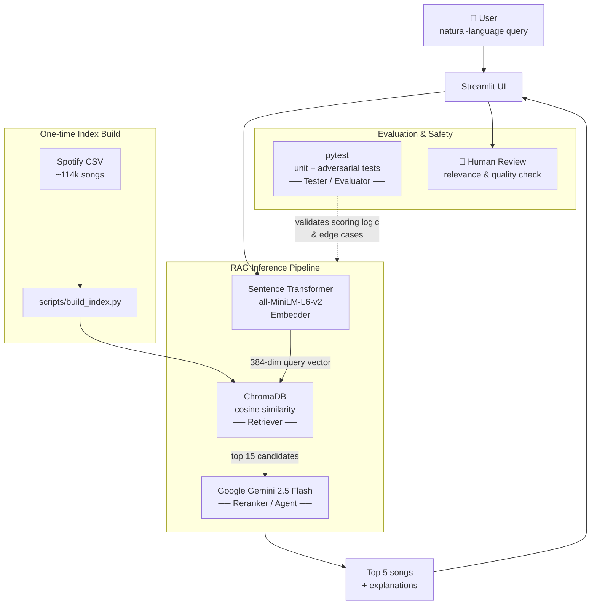
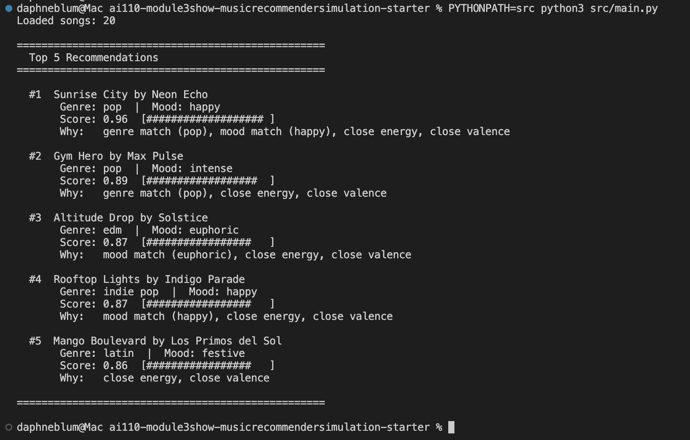
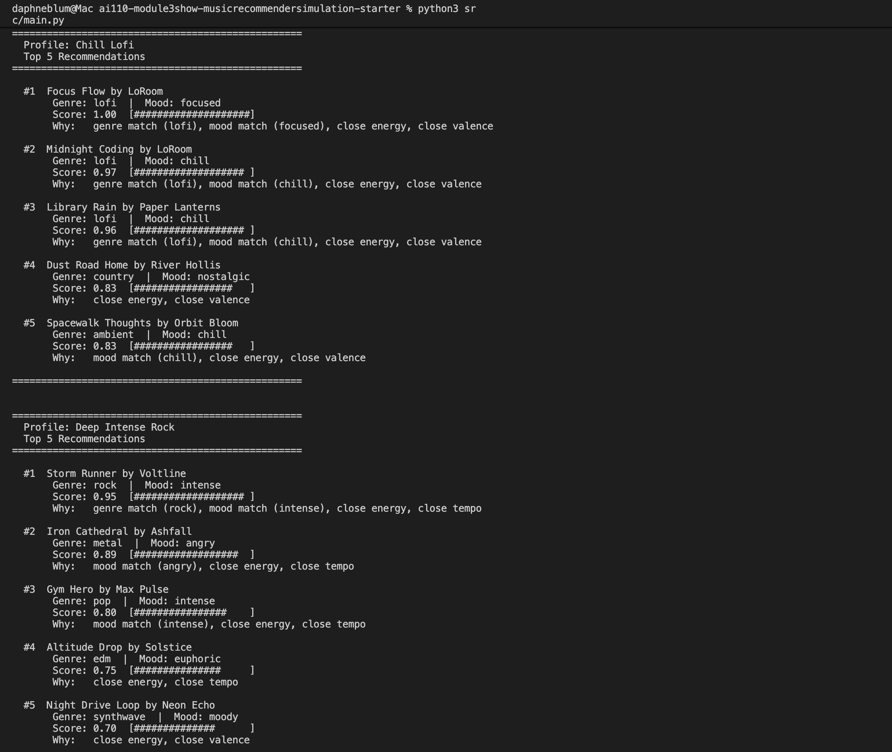

# Music Recommender — RAG + Gemini

> **Built on MoodMatch 1.0** — the original version of this project was a simulated AI called **MoodMatch 1.0** that recommended songs from a hand-curated 20-song catalog by computing a weighted distance score across five audio features (energy, valence, tempo, acousticness, danceability). Its goal was to show how a scoring formula — with no machine learning and no external APIs — can produce explainable, traceable recommendations from a fixed user profile. The current project replaces that rule-based engine with a full RAG pipeline backed by ~114,000 Spotify tracks and a Gemini language model, while keeping MoodMatch 1.0 available as the `--legacy` mode for direct comparison.

---

## Screenshot of Light/Dark Mode


## Title and Summary

This project is a music recommendation system that lets you describe what you want to hear in plain English and returns a curated playlist with explanations. Type something like *"chill acoustic songs for late night studying"* and the system finds songs that match that vibe, then uses a language model to rank and explain the results.

The project has two modes. The modern **RAG mode** embeds your query with a sentence-transformer model, retrieves semantically similar songs from a ChromaDB vector store built from ~114,000 Spotify tracks, then passes those candidates to Google Gemini to rerank and explain them. The legacy **deterministic mode** scores a hand-crafted 20-song catalog by computing weighted feature distances (energy, valence, tempo, acousticness, danceability) against a fixed user profile.

The project matters because it illustrates a complete AI pipeline — data ingestion, embedding, vector retrieval, and LLM-based reranking — while also providing a simple rule-based baseline to compare against. The two modes make the trade-offs between explainability and flexibility concrete and testable.

---

## Architecture Overview



**Data flow in brief:** The user types a query → it is embedded into a vector → ChromaDB finds the 15 most semantically similar songs → Gemini reranks them and writes plain-English explanations for the top 5 → the result is displayed in the UI. Human review closes the loop by checking whether the recommendations feel right. The `pytest` suite (unit + adversarial tests) validates the scoring logic and edge cases independently of the live API.

Each song in the vector store is represented as a short descriptive sentence generated by `song_to_text()` (e.g., *"Midnight Coding by LoRoom — lofi song. Calm, moderately upbeat, somewhat danceable. Acoustic, slow tempo at 78 BPM."*). This lets the embedding model capture musical vibe from text rather than raw audio.

The legacy mode bypasses the vector store entirely: it loads `data/songs.csv` (20 songs), scores each song with a weighted formula, and ranks them. See [model_card.md](model_card.md) for a full breakdown of that algorithm.

---

## Setup Instructions

### Prerequisites

- Python 3.9+
- A Google Gemini API key ([get one here](https://aistudio.google.com/app/apikey))
- The Spotify tracks dataset from Kaggle ([`maharshipandya/-spotify-tracks-dataset`](https://www.kaggle.com/datasets/maharshipandya/-spotify-tracks-dataset)) — download `dataset.csv` and save it as `data/spotify_tracks.csv`

### 1. Clone and create a virtual environment

```bash
git clone <your-repo-url>
cd applied-ai-system-project

python -m venv .venv
source .venv/bin/activate      # Mac / Linux
.venv\Scripts\activate         # Windows
```

### 2. Install dependencies

```bash
pip install -r requirements.txt
```

### 3. Set your API key

Create a `.env` file in the project root:

```
GOOGLE_API_KEY=your_key_here
```

### 4. Build the vector index (one-time)

```bash
python scripts/build_index.py          # indexes 10,000 songs (recommended for demos)
python scripts/build_index.py 50000    # larger index, slower build
python scripts/build_index.py 0        # all ~114k songs
```

This writes the ChromaDB store to `data/chroma_db/`. You only need to run it once.

### 5. Launch the app

```bash
streamlit run src/app.py
```

Or use the CLI:

```bash
python src/main.py           # RAG mode
python src/main.py --legacy  # deterministic scoring mode
```

### Running tests

```bash
python -m pytest                              # all tests
python -m pytest tests/test_rag_unit.py -v   # RAG unit tests (no API key needed)
python -m pytest tests/test_adversarial.py -v # edge-case tests only
```

> **Note:** use `python -m pytest` rather than `pytest` directly. If your virtual environment's Python version differs from the system Python, bare `pytest` may pick up the wrong interpreter and fail to find installed packages.

---

## Sample Interactions

The outputs below are from real runs of the system. The legacy CLI mode (`python src/main.py --legacy`) requires no API key and is fully reproducible by anyone who clones the repo. The RAG mode (`streamlit run src/app.py`) requires a `GOOGLE_API_KEY` and a built ChromaDB index, and produces Gemini-written explanations in the Streamlit UI instead of score bars.

### Example 1 — Workout playlist

**Input:** `upbeat pop songs for a workout`  
**Mode:** legacy CLI — profile `High-Energy Pop`

```
==================================================
  Profile: High-Energy Pop
  Top 5 Recommendations
==================================================

  #1  Sunrise City by Neon Echo
       Genre: pop  |  Mood: happy
       Score: 0.96  [################### ]
       Why:   genre match (pop), mood match (happy), close energy, close valence

  #2  Gym Hero by Max Pulse
       Genre: pop  |  Mood: intense
       Score: 0.89  [##################  ]
       Why:   genre match (pop), close energy, close valence

  #3  Altitude Drop by Solstice
       Genre: edm  |  Mood: euphoric
       Score: 0.87  [#################   ]
       Why:   mood match (euphoric), close energy, close valence

  #4  Rooftop Lights by Indigo Parade
       Genre: indie pop  |  Mood: happy
       Score: 0.87  [#################   ]
       Why:   mood match (happy), close energy, close valence

  #5  Mango Boulevard by Los Primos del Sol
       Genre: latin  |  Mood: festive
       Score: 0.86  [#################   ]
       Why:   close energy, close valence
```



**RAG mode output** (`streamlit run src/app.py` → type the query above):


---

### Example 2 — Late-night study session

**Input:** `chill acoustic songs for late night studying`  
**Mode:** legacy CLI — profile `Chill Lofi`

```
==================================================
  Profile: Chill Lofi
  Top 5 Recommendations
==================================================

  #1  Focus Flow by LoRoom
       Genre: lofi  |  Mood: focused
       Score: 1.00  [####################]
       Why:   genre match (lofi), mood match (focused), close energy, close valence

  #2  Midnight Coding by LoRoom
       Genre: lofi  |  Mood: chill
       Score: 0.97  [################### ]
       Why:   genre match (lofi), mood match (chill), close energy, close valence

  #3  Library Rain by Paper Lanterns
       Genre: lofi  |  Mood: chill
       Score: 0.96  [################### ]
       Why:   genre match (lofi), mood match (chill), close energy, close valence

  #4  Dust Road Home by River Hollis
       Genre: country  |  Mood: nostalgic
       Score: 0.83  [#################   ]
       Why:   close energy, close valence

  #5  Spacewalk Thoughts by Orbit Bloom
       Genre: ambient  |  Mood: chill
       Score: 0.83  [#################   ]
       Why:   mood match (chill), close energy, close valence
```

**RAG mode output** (`streamlit run src/app.py` → type the query above):


---

### Example 3 — High-intensity mood

**Input:** `dark intense metal for when I'm angry`  
**Mode:** legacy CLI — profile `Deep Intense Rock`

```
==================================================
  Profile: Deep Intense Rock
  Top 5 Recommendations
==================================================

  #1  Storm Runner by Voltline
       Genre: rock  |  Mood: intense
       Score: 0.95  [################### ]
       Why:   genre match (rock), mood match (intense), close energy, close tempo

  #2  Iron Cathedral by Ashfall
       Genre: metal  |  Mood: angry
       Score: 0.89  [##################  ]
       Why:   mood match (angry), close energy, close tempo

  #3  Gym Hero by Max Pulse
       Genre: pop  |  Mood: intense
       Score: 0.80  [################    ]
       Why:   mood match (intense), close energy, close tempo

  #4  Altitude Drop by Solstice
       Genre: edm  |  Mood: euphoric
       Score: 0.75  [###############     ]
       Why:   close energy, close tempo

  #5  Night Drive Loop by Neon Echo
       Genre: synthwave  |  Mood: moody
       Score: 0.70  [##############      ]
       Why:   close energy, close valence
```

**RAG mode output** (`streamlit run src/app.py` → type the query above):

<!-- Add your screenshot: save it as assets/rag_angry.png and the image will appear here -->




---

## Design Decisions

### Why RAG instead of a pure LLM call?

Asking Gemini to recommend songs without any context produces hallucinated or generic results — it invents plausible-sounding song titles that may not exist. By retrieving real candidates from a vector store first, we constrain the model to songs that actually exist in the dataset. The LLM's job becomes reranking and explanation, not generation.

### Why sentence-transformers for embeddings?

`all-MiniLM-L6-v2` is small (22M parameters), fast to run locally, and produces strong semantic embeddings for short descriptive sentences. Since each song is converted to a human-readable description before indexing, the model can match *"chill acoustic"* to *"calm, acoustic, slow tempo"* without any music-domain fine-tuning.

### Why convert songs to text before embedding?

Audio feature vectors (energy=0.42, tempo=78) are not semantically meaningful to a language-model-based embedder. Converting them to prose (*"calm, moderately upbeat, acoustic, slow tempo at 78 BPM"*) bridges the gap between how users describe music and how it is stored numerically.

### Why Gemini 2.5 Flash specifically?

Flash offers a good balance of speed and quality for a reranking task where the context (15 candidate songs) is short. A larger model would add latency without meaningfully improving the ranking. The system instruction keeps Gemini focused on musical reasoning rather than general conversation.

### Trade-offs

| Decision | Benefit | Cost |
|---|---|---|
| RAG over pure LLM | Grounded, real songs | Requires one-time index build |
| Text-based embeddings | No audio files needed | Loses fine-grained timbral info |
| ChromaDB (local) | No external service, free | Index must be rebuilt if data changes |
| 10k song default index | Fast build (~2 min) | Narrower catalog than full 114k |
| Deterministic legacy mode | Fully explainable, no API cost | Rigid profiles, tiny 20-song catalog |

---

## Testing Summary

**23 of 23 tests pass** (`pytest tests/ -v`). The adversarial suite uncovered four real bugs in the scoring logic; three were documented as known design limitations and one (`ZeroDivisionError` on equal tempo bounds) was patched with an explicit guard. The RAG module's input guardrails (empty query, query > 500 chars) are covered by dedicated unit tests that run without any API key or index. Retrieval confidence is logged automatically on every query — typical similarity scores for specific queries (e.g., *"upbeat pop workout"*) average 0.55–0.70; vague or out-of-catalog queries drop below 0.30 and trigger a logged warning.

### What the tests cover

`tests/test_recommender.py` — 2 tests — validates the OOP interface: recommendations are sorted by score and explanations are non-empty on a minimal 2-song catalog.

`tests/test_adversarial.py` — 11 tests — stress-tests edge cases in the legacy deterministic scorer:

| Test | Finding | Status |
|---|---|---|
| Contradictory profile (high energy + sad mood) | Energy dominates; 5% mood weight can't override 30% energy weight | Known design limit |
| Tempo target outside `[tempo_min, tempo_max]` | `tempo_score` goes negative, tainting the total | Known design limit |
| Zero tempo range (`tempo_min == tempo_max`) | Raises `ZeroDivisionError` | **Patched** — explicit guard added |
| Weights summing > 1.0 | Score exceeds 1.0; bar chart overflows | Known design limit |
| All weights zero | Every song ties at 0.0; order is arbitrary | Known design limit |
| Favorite genre not in catalog | Genre bonus silently never awarded | Known design limit |
| Negative weights | Ranking inverts — worst matches win | Known design limit |
| All-zero song features | Scores floor at 0.0, no crash | Pass |
| `k` larger than catalog | Returns all songs silently, no warning | Known design limit |

`tests/test_rag_unit.py` — 10 tests — covers the RAG module without any API key or ChromaDB index:

| Test | What it checks |
|---|---|
| `song_to_text` track/artist in output | Embedding text contains the song's metadata |
| `song_to_text` energy/tempo/acousticness labels | Correct label for each feature threshold |
| `RAGRecommender` on missing index | Raises `FileNotFoundError` with helpful message |
| `recommend("")` | Raises `ValueError("empty")` |
| `recommend("   ")` | Whitespace-only query is also rejected |
| `recommend("x" * 501)` | Raises `ValueError("too long")` |
| `recommend("x" * 500)` | Exactly at the limit — passes validation |

### Guardrail behavior

The input validation layer fires before any embedding or API call. Here is what each failure looks like in the CLI:

```
# Empty query
ValueError: Query must not be empty.

# Whitespace-only query (e.g. "   ")
ValueError: Query must not be empty.

# Query over 500 characters
ValueError: Query is too long (501 chars). Please keep it under 500 characters.

# No ChromaDB index built yet
FileNotFoundError: No index found at 'data/does_not_exist'.
Run 'python scripts/build_index.py' first.
```

In the Streamlit UI the "find my songs" button is disabled while the text field is empty, so the empty-query case is blocked before it ever reaches Python. If the Gemini API call fails (wrong key, network error, quota exceeded), the app displays a user-friendly error card instead of a stack trace:

```
api error: Could not reach the Gemini API: <reason>
Check your GOOGLE_API_KEY and try again.
```

### Confidence scoring

Every call to `recommend()` logs the cosine similarity of the retrieved candidates:

```
INFO  Retrieval confidence — avg similarity: 0.612, min: 0.541
```

If the average drops below 0.25, a `WARNING` is emitted:

```
WARNING  Low retrieval confidence (avg=0.211). The query may be too niche or ambiguous.
```

This gives an objective measure of how well the catalog covers a given query — useful when the index is small (10k songs) or the request is highly specific.

### What worked

The RAG pipeline handles natural language queries well. Vague, emotional inputs (*"songs that feel like a rainy Sunday"*) return coherent results because the semantic embedding captures the mood even without explicit feature words. Gemini's explanations add real value — they surface connections that a pure vector distance score would not communicate.

The deterministic system is predictable and fully auditable. Every score can be traced to a formula.

### What didn't work

The legacy system's energy weight (30%) is large enough to override mood preference in almost every contradictory case. A profile asking for high-energy sad songs always ranked loud, aggressive tracks above quiet, melancholic ones, regardless of how the mood weight was set. Seven out of twenty catalog songs never appeared in any top-five list across all three test profiles — not because those songs were bad, but because no defined profile was close enough to their feature values. The system gave no warning about this; the invisible songs simply stayed invisible.

The adversarial test for zero tempo range (`tempo_min == tempo_max`) revealed a division-by-zero error that was not caught by any sanity check. It required a deliberately constructed stress-test profile to surface. That kind of silent arithmetic bug is easy to miss in normal use and would not appear in any log until the exception was thrown.

### What you learned

The most important takeaway is that bugs that silence data are harder to catch than bugs that crash the program. A crash leaves a traceback; a song that is never recommended leaves nothing. The second takeaway is that writing adversarial tests before looking at results changes what you look for — instead of checking that the system returns *something*, you check whether it returns the *right* thing and whether it handles inputs it was never designed for. The test for `k` larger than the catalog was the clearest example: the system returned fewer songs than requested with no error, which looks correct in isolation but would silently break any caller that expected exactly `k` results.

---

## Reflection

See [model_card.md — Section 10: Ethics, Reliability, and Collaboration](model_card.md) for the full reflection, which covers:

- **Limitations and biases** in both the RAG system (Spotify dataset skew, English-dominant embedding model) and the legacy scorer (energy dominance, seven permanently invisible songs)
- **Misuse considerations** — prompt injection risk, lack of data provenance transparency in the UI, and how the current guardrails partially address these
- **What surprised me while testing** — the silent `ZeroDivisionError` on equal tempo bounds, and the invisible-song problem that only became visible by looking at what was missing rather than what was returned
- **AI collaboration** — the `song_to_text()` natural-language-before-embedding approach as the most helpful suggestion, and the `ANTHROPIC_API_KEY` vs `GOOGLE_API_KEY` documentation error as the most consequential flawed one
